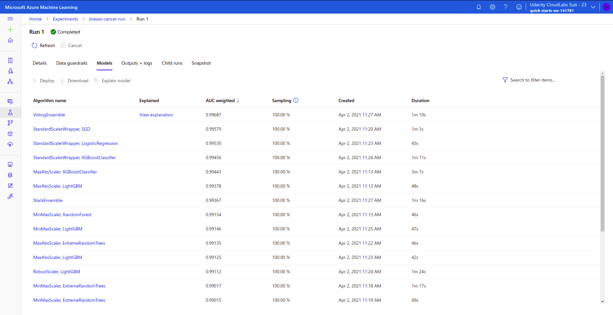
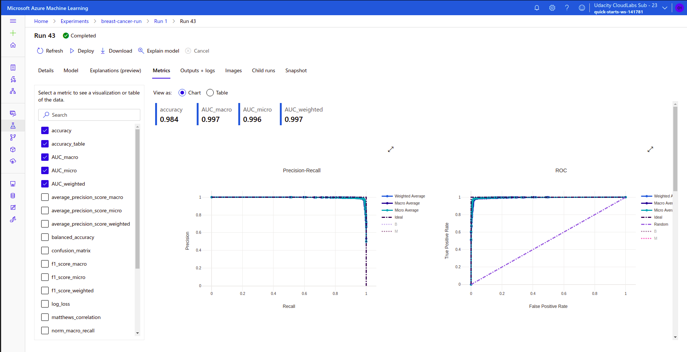
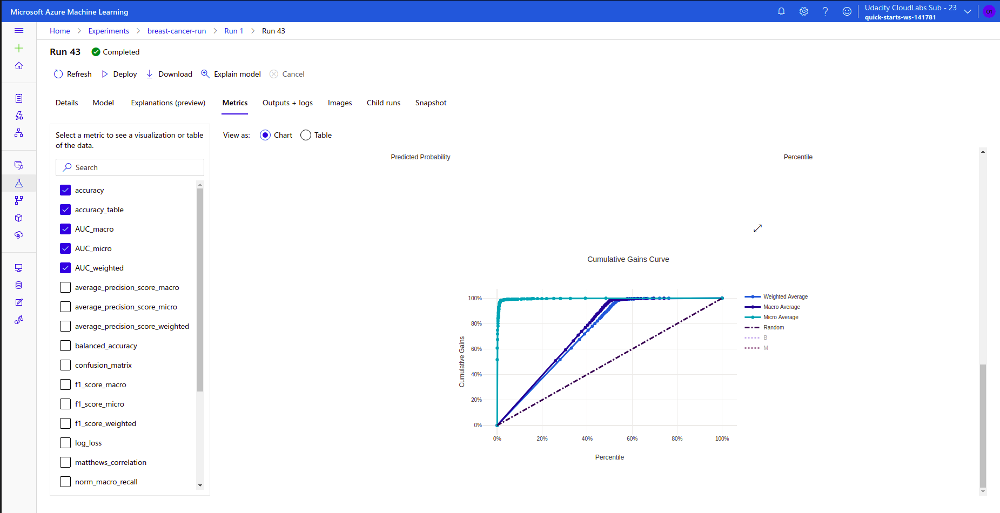
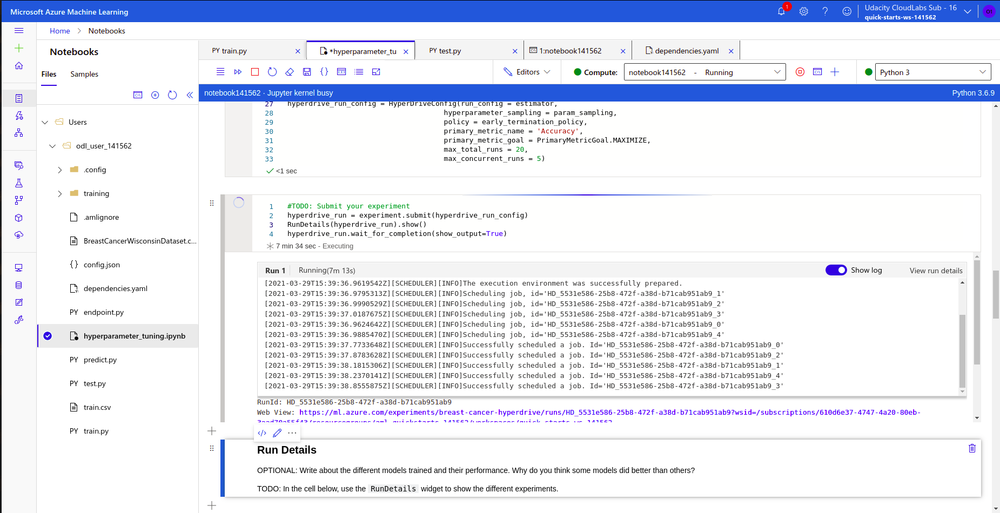
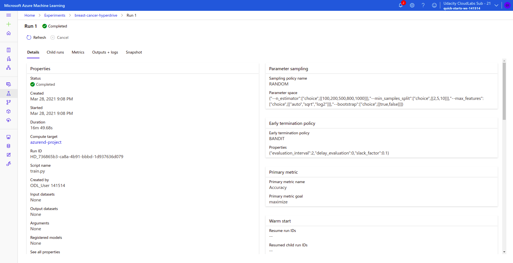
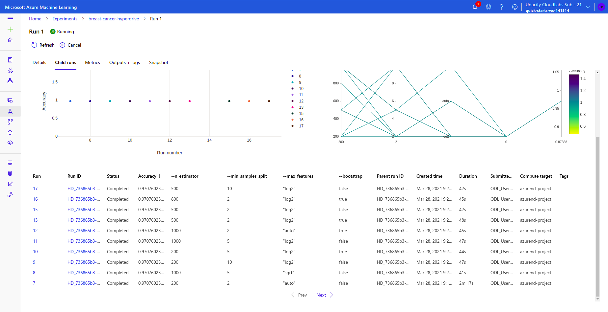

# Machine Learning Engineer with Microsoft Azure - Capstone Project

This project is part of the Machine Learning Engineer with Microsoft Azure Nanodegree Program by Udacity and Microsoft.

## Dataset
The dataset used in this project is the Wisconsin Breast Cancer dataset from Kaggle. Two different models are developed, one model trained using Automated ML (AutoML) and the other model trained and tuned with HyperDrive. The performance of both the models are compared and the best model is deployed. The model is then consumed from the generated REST endpoint.

### Overview
The dataset is obtained is the Wisconsin Breast Cancer dataset from Kaggle. The features are computed from a digitized image of a fine needle aspirate (FNA) of a breast mass. The mean, standard error and "worst" or largest (mean of the three largest values) of these features were computed for each image, resulting in 30 features. The class distribution is 357 benign, 212 malignant.

Attribute Information:

1) ID number<br>
2) Diagnosis (M = malignant, B = benign)<br>
3-32)

Ten real-valued features are computed for each cell nucleus:

a) radius (mean of distances from center to points on the perimeter)<br>
b) texture (standard deviation of gray-scale values)<br>
c) perimeter<br>
d) area<br>
e) smoothness (local variation in radius lengths)<br>
f) compactness (perimeter^2 / area - 1.0)<br>
g) concavity (severity of concave portions of the contour)<br>
h) concave points (number of concave portions of the contour)<br>
i) symmetry<br>
j) fractal dimension ("coastline approximation" - 1)

### Task
The dataset provides us with a binary classification task that requires us to classify the the given details of the FNA image into two classes: Malignant and Benign. All the attributes excluding the *ID Number* are used for training the model. The column *diagnosis* is the target variable.

### Access
The dataset is uploaded into this github repository which then is associated with raw github content URL. This URL is used to access the dataset from the workspace.<br>
https://raw.githubusercontent.com/MonicaSai7/Capstone-Project---Azure-Machine-Learning-Engineer/main/BreastCancerWisconsinDataset.csv

## Automated ML
The major *AutoML Settings* are defined as:<br>
1. ```"experiment_timeout_minutes" = 20```<br>
  The maximum amount of time in minutes that all iterations combined can take before the experiment terminates. This configuration has been set to 20 due to on-demand lab duration. <br><br>
2. ```"primary_metric" = 'AUC_weighted'```<br>
  The metrics that Azure AutoML will optimize for model selection.<br><br>

The configurations for the *AutoMLConfig* instance are defined as:<br>
1. ```task = "classification"```<br>
  The task of the dataset and experiment which is a binary classification task.<br>
2. ```label_column_name="diagnosis"```<br>
  The name of the label column which needs to be predicted. The target column in this dataset is the *"diagnosis"* column whose values are either Malignant or Benign.<br>
3. ```enable_early_stopping= True```<br>
  Whether to enable early termination if the score is not improving in the short term. Early stopping is triggered if the absolute value of best score calculated is the same for past early_stopping_n_iters iterations, that is, if there is no improvement in score for early_stopping_n_iters iterations. <br><br>
 
The run details of the AutomatedML run are as below:<br><br>
<br><br>

The different models run during the experiment:<br><br>
<br><br>

### Results
The AutoML experiment run generated VotingEnsemble algorithm as the best model with accuracy of 0.9841478696741854. <br>

A voting ensemble (or a “majority voting ensemble“) is an ensemble machine learning model that combines the predictions from multiple other models. It is a technique that may be used to improve model performance, ideally achieving better performance than any single model used in the ensemble. A voting ensemble works by combining the predictions from multiple models. It can be used for classification or regression. In the case of regression, this involves calculating the average of the predictions from the models. In the case of classification, the predictions for each label are summed and the label with the majority vote is predicted.<br>
Voting ensembles are most effective when:

  - Combining multiple fits of a model trained using stochastic learning algorithms.<br>
  - Combining multiple fits of a model with different hyperparameters.<br>
 
The best model details are given as below:<br><br>
<br><br>

The metrics of the best run model can be seen as below:<br><br>
<br><br>
<br><br>
<br><br>

## Hyperparameter Tuning
The model used in this experiment is the *RandomForestClassifier* from sklearn library. A random forest is a meta estimator that fits a number of decision tree classifiers on various sub-samples of the dataset and uses averaging to improve the predictive accuracy and control over-fitting. The sub-sample size is controlled with the max_samples parameter if bootstrap=True (default), otherwise the whole dataset is used to build each tree.<br>

Random forest adds additional randomness to the model, while growing the trees. Instead of searching for the most important feature while splitting a node, it searches for the best feature among a random subset of features. This results in a wide diversity that generally results in a better model.<br>

The required dataset is loaded as a dataframe using pandas library. The dataset is split into test and train with the test set being 30% of the data and at the default random state of 42. The scikit-learn pipeline uses the RandomForestClassifier which requires the following hyperparameters:<br>

1. --n_estimators - Number of trees in the forest.<br>
2. --min_samples_split - Minimum number of samples required to split an internal node.<br>
3. --max_features - {'auto', 'sqrt', 'log2'}<br>
The number of features to consider when looking for the best split:

If int, then consider max_features features at each split.

If float, then max_features is a fraction and round(max_features * n_features) features are considered at each split.

If “auto”, then max_features=sqrt(n_features).

If “sqrt”, then max_features=sqrt(n_features) (same as “auto”).

If “log2”, then max_features=log2(n_features).

If None, then max_features=n_features.<br>
4. --bootstrap - Whether bootstrap samples are used when building trees. If False, the whole dataset is used to build each tree.

A compute cluster with vm_size ```STANDARD_D2_V2``` and 4 maximum nodes is used to run the experiment. The HyperDriveConfig is created with the mentioned samples, estimater and policy along with maximum total runs set to 20 and maximum concurrent runs to 5.

There are three types of sampling in the hyperparameter space:<br>
1. **Random Sampling**<br>
Random sampling supports discrete and continuous hyperparameters. It supports early termination of low-performance runs. In random sampling, hyperparameter values are randomly selected from the defined search space.

2. **Grid Sampling**<br>
Grid sampling supports discrete hyperparameters. Use grid sampling if you can budget to exhaustively search over the search space. Supports early termination of low-performance runs. Performs a simple grid search over all possible values. Grid sampling can only be used with choice hyperparameters. 

3. **Bayesian Sampling**<br>
Bayesian sampling is based on the Bayesian optimization algorithm. It picks samples based on how previous samples performed, so that new samples improve the primary metric. Bayesian sampling is recommended if you have enough budget to explore the hyperparameter space. For best results, we recommend a maximum number of runs greater than or equal to 20 times the number of hyperparameters being tuned.

Random Sampling is chosen as the sampling parameter as it supports both discrete and continuous hyperparameters providing a wider range of possible parameter combinations for the users. Grid sampling supports only discrete hyperparameters and performs an exhaustive search over the parameter space which requires high computational resources. Bayesian Sampling is justified when the maximum runs is greater than equal to 20, also demanding budget enough to withstand. Apart from that Bayesian sampling does not support early termination which is a requirement for our project. So, random sampling is an efficient choice for our dataset.

Bandit policy is based on slack factor/slack amount and evaluation interval. Bandit terminates runs where the primary metric is not within the specified slack factor/slack amount compared to the best performing run. Bandit Policy with a smaller allowable slack is used for aggressive savings, which means that the running jobs can be terminated by Azure in case of higher priority requirements of resources. Since our project does not need to run continuously, such an aggressive savings policy is sufficient than a conservative savings policy.<br>

The run details of the experiment:<br><br>
<br><br>
<br><br>

### Results
The Hyperdrive tuned best model generated an accuracy of ```0.9766081871345029``` with the following the configurations:<br>
```No of Estimators: 200```<br>
```Min No of Samples to Split: 2```<br>
```No of Features Considered: sqrt```<br>
```Bootstrap: True```<br>

All the iteration/child runs of the experiment with different hyperparamters are:<br><br>
<br><br>

## Model Deployment
Deploying the best model will allow us to interact with the HTTP API service by sending data over POST requests.

The following screenshot shows the real-time endpoint created after the best model is deployed:<br><br>
<br><br>

The endpoint.py script can be used to make a POST request for predicting the label of given records.

## Screen Recording
The screencast of the project demo can be viewed [here](https://youtu.be/u6pxAdoeCBA)
